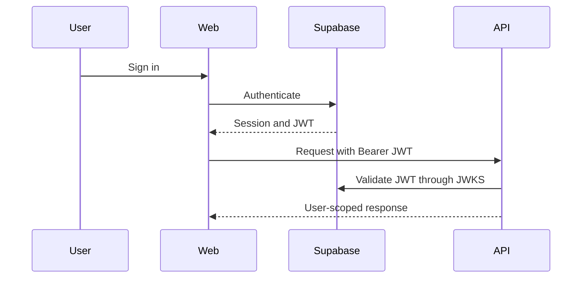

# API Design

## Status

Milestone 6 implements system probes, protected profiles, task CRUD, plan-first
gym workout logging, private daily journaling, and a protected daily dashboard.
Other product feature endpoints remain planned.

## Conventions

- Feature endpoints use the `/api/v1` prefix.
- System probes use unversioned `/health` and `/ready` paths.
- JSON is the default request and response format.
- Resource identifiers are UUIDs.
- Timestamps use ISO 8601 UTC values.
- Protected endpoints require `Authorization: Bearer <token>`.
- User-owned queries are always scoped by the authenticated `user_id`.

Routers handle HTTP translation, services enforce business rules and ownership,
and repositories perform persistence operations.

## Planned Endpoints

| Area | Planned routes |
| --- | --- |
| System | `GET /health`, `GET /ready` (implemented) |
| Profile | `GET /api/v1/me`, `PATCH /api/v1/me` (implemented) |
| Tasks | CRUD at `/api/v1/tasks` (implemented) |
| Journal | Daily entries and history at `/api/v1/journal/entries` (implemented) |
| Workouts | Plans, exercises, sessions, and sets under `/api/v1/workouts` (implemented) |
| Dashboard | `GET /api/v1/dashboard` daily snapshot (implemented) |
| Notes | CRUD at `/api/v1/notes` |
| Running | Sessions and progress under `/api/v1` |

Tasks, profile, workouts, and journal will be implemented before notes, running,
and integrations.

## Dashboard

`GET /api/v1/dashboard?local_date=YYYY-MM-DD` returns a read-only snapshot of
the authenticated user's open-task count and next tasks, active and latest
completed workouts, and journal status for the browser's local calendar date.
Ownership always comes from the validated JWT subject. The dashboard adds no
new persistence and performs no cross-feature mutations.

## Journal

All journal routes require a valid bearer token. Ownership comes exclusively
from the validated JWT subject. The browser supplies its local calendar date
for the Today workflow; it never supplies ownership.

| Method | Route | Behavior |
| --- | --- | --- |
| `GET` | `/api/v1/journal/entries` | Search and paginate owned history |
| `GET` | `/api/v1/journal/entries/today` | Read the entry for a supplied local date |
| `PUT` | `/api/v1/journal/entries/today` | Idempotently save the entry for a supplied local date |
| `GET` | `/api/v1/journal/entries/{entry_id}` | Read one owned entry |
| `PATCH` | `/api/v1/journal/entries/{entry_id}` | Edit one owned entry |
| `DELETE` | `/api/v1/journal/entries/{entry_id}` | Delete one owned entry |

## Responses and Errors

Future APIs should use typed Pydantic response schemas and consistent error
bodies containing a stable error code, a human-readable message, and optional
validation details. HTTP status codes remain the primary transport-level error
signal.

The first list endpoint uses limit-and-offset pagination. Future list endpoints
should follow the same response shape unless their access pattern requires a
documented alternative.

## Tasks

All task routes require a valid bearer token. Ownership comes exclusively from
the validated JWT subject.

| Method | Route | Behavior |
| --- | --- | --- |
| `POST` | `/api/v1/tasks` | Create an owned task |
| `GET` | `/api/v1/tasks` | List owned tasks with pagination and completion filter |
| `GET` | `/api/v1/tasks/{task_id}` | Read one owned task |
| `PATCH` | `/api/v1/tasks/{task_id}` | Update or complete/reopen one owned task |
| `DELETE` | `/api/v1/tasks/{task_id}` | Delete one owned task |

The list route accepts `limit`, `offset`, and optional `completed` query
parameters. It returns `items`, `total`, `limit`, and `offset`.

## Workouts

All workout routes require a valid bearer token. The API exposes the shared
exercise catalog and starter plan alongside user-owned custom plans. Starting a
training day snapshots its ordered exercises into a user-owned workout session
and generates the target sets for fast logging.

- `GET/POST /api/v1/workouts/exercises`
- `GET/POST /api/v1/workouts/plans`
- `PUT /api/v1/workouts/plans/{plan_id}`
- `POST /api/v1/workouts/plans/{plan_id}/clone`
- `POST /api/v1/workouts/plans/{plan_id}/days/{day_id}/start`
- `GET /api/v1/workouts/sessions`
- `GET/PATCH /api/v1/workouts/sessions/{session_id}`
- `DELETE /api/v1/workouts/sessions/{session_id}`
- `PATCH /api/v1/workouts/sets/{set_id}`

## Authentication

`GET /api/v1/me` creates the initial application profile when an authenticated
Supabase user does not have one. `PATCH /api/v1/me` accepts only
`display_name`, `timezone`, and `locale`. Ownership always comes from the
validated token subject.
