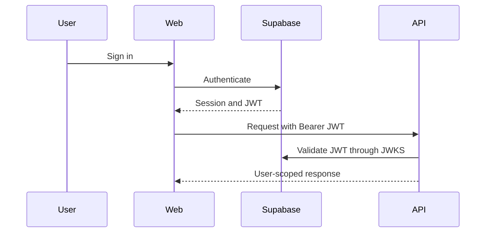

# API Design

## Status

Milestone 2 implements system probes and the protected current-profile
endpoints. Product feature endpoints remain planned.

## Conventions

- Feature endpoints use the `/api/v1` prefix.
- System probes use unversioned `/health` and `/ready` paths.
- JSON is the default request and response format.
- Resource identifiers are UUIDs.
- Timestamps use ISO 8601 UTC values.
- Protected endpoints require `Authorization: Bearer <token>`.
- User-owned queries are always scoped by the authenticated `user_id`.

Routers handle HTTP translation, services enforce business rules and ownership,
and repositories perform persistence operations.

## Planned Endpoints

| Area | Planned routes |
| --- | --- |
| System | `GET /health`, `GET /ready` (implemented) |
| Profile | `GET /api/v1/me`, `PATCH /api/v1/me` (implemented) |
| Tasks | CRUD at `/api/v1/tasks` |
| Journal | CRUD at `/api/v1/journal-entries` |
| Workouts | Exercises, sessions, sets, and progress under `/api/v1` |
| Notes | CRUD at `/api/v1/notes` |
| Running | Sessions and progress under `/api/v1` |

Tasks, profile, workouts, and journal will be implemented before notes, running,
and integrations.

## Responses and Errors

Future APIs should use typed Pydantic response schemas and consistent error
bodies containing a stable error code, a human-readable message, and optional
validation details. HTTP status codes remain the primary transport-level error
signal.

List endpoints should introduce pagination when the first list feature is
implemented. The specific contract will be documented at that milestone rather
than invented during Milestone 0.

## Authentication

`GET /api/v1/me` creates the initial application profile when an authenticated
Supabase user does not have one. `PATCH /api/v1/me` accepts only
`display_name`, `timezone`, and `locale`. Ownership always comes from the
validated token subject.
