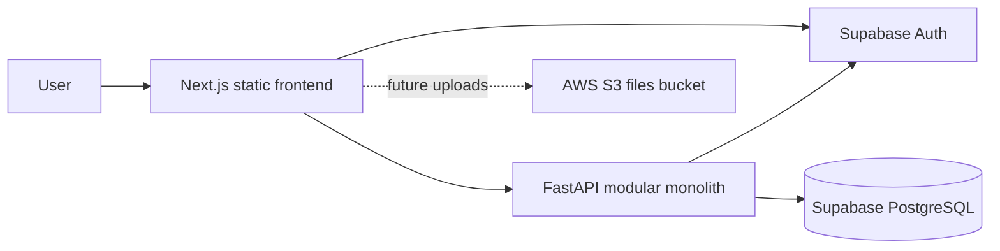

# Architecture

## Current State

Milestone 1 provides a runnable static Next.js shell and FastAPI application.
The backend currently exposes only system health endpoints. Authentication,
database access, and product modules are not active yet.

## System Context



## Modular Monolith

The backend will be one deployable FastAPI application with modules for users,
tasks, workouts, journal, notes, running, and integrations. A modular monolith
keeps deployment and operations simple while providing clear ownership
boundaries inside the codebase.

Each active module will use:

```text
HTTP request
  -> router.py
  -> service.py
  -> repository.py
  -> PostgreSQL
```

- Routers handle HTTP concerns and dependencies.
- Schemas validate API requests and responses.
- Services enforce ownership and business rules.
- Repositories contain database queries.
- Models describe persisted data.

Modules may share narrowly scoped infrastructure from `app/core` and reusable
application utilities from `app/shared`. Modules should not bypass service
boundaries to manipulate another module's persistence directly.

## Frontend Organization

The frontend will use Next.js App Router pages for routing and feature folders
for domain-specific API calls, types, hooks, components, and utilities.
Cross-feature UI belongs in `src/components`.

The interface will be mobile-first, with bottom navigation on mobile and a
sidebar on desktop.

## Security Boundary

Supabase Auth issues the user JWT. The frontend sends the JWT to FastAPI in the
`Authorization` header. FastAPI validates the token, extracts `user_id`, and
scopes every user-owned query to that identifier.

The backend never trusts resource ownership supplied by the frontend.

## Deployment Shape

The frontend is planned as a static Next.js export hosted in S3 behind
CloudFront and Cloudflare. The backend is a Dockerized FastAPI service deployed
later to ECS/Fargate or Elastic Beanstalk. Supabase provides hosted PostgreSQL
and authentication.
