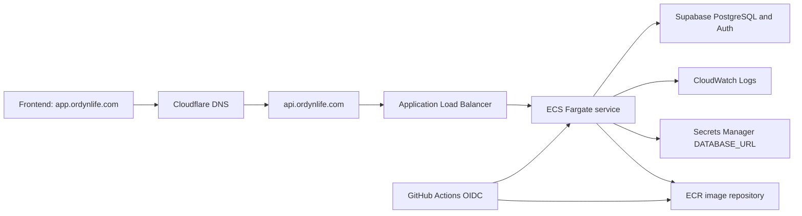

# Backend AWS Infrastructure Runbook

## Purpose

This document records the AWS backend deployment work done for Ordyn Life so it
can be understood or rebuilt later. The current product decision is to use the
backend locally and not keep paid AWS backend infrastructure running for a small
personal user base.

No secrets are documented here. Resource names, ARNs, domains, and IDs are
included because they are infrastructure identifiers, not credentials.

## Current Status

As of August 11, 2026:

- The ECS backend service has been paused.
- ECS desired count is `0`.
- ECS running task count is `0`.
- The AWS backend resources were then deleted after confirming local-only
  backend usage.
- Deleted resources include the ECS service, ECS cluster, ALB, target group,
  ECR repository/images, Secrets Manager database secret, CloudWatch log group,
  backend security groups, backend ACM certificate, backend ECS execution role,
  and backend GitHub OIDC deploy role.
- The deployed API at `https://api.ordynlife.com` should not be considered
  available.
- The local FastAPI backend remains the preferred development path.
- The frontend AWS resources are separate and were not deleted.
- Supabase was not deleted.

Pause/resume helper:

```powershell
.\infra\aws\backend-service.ps1 status
.\infra\aws\backend-service.ps1 pause
.\infra\aws\backend-service.ps1 resume
```

The helper is historical now. It only applies if the ECS backend service is
rebuilt.

## Implemented Backend Architecture

The backend was deployed as a Dockerized FastAPI app on ECS/Fargate behind an
Application Load Balancer.



Implemented resources:

| Area | Resource |
| --- | --- |
| AWS account | `575124957640` |
| Region | `us-east-1` |
| API domain | `https://api.ordynlife.com` |
| ECR repository | `ordyn-life-api` |
| ECS cluster | `ordyn-life` |
| ECS service | `ordyn-life-api` |
| ECS task family | `ordyn-life-api` |
| Migration task family | `ordyn-life-api-migration` |
| ECS container name | `ordyn-life-api` |
| ALB | `ordyn-life-api-alb` |
| ALB DNS | `ordyn-life-api-alb-2123102133.us-east-1.elb.amazonaws.com` |
| Target group | `ordyn-life-api-tg` |
| Runtime secret | `ordyn-life-api/database-url` |
| Log group | `/ecs/ordyn-life-api` |
| ECS execution role | `ordyn-life-ecs-task-execution-role` |
| GitHub deploy role | `ordyn-life-github-api-deploy-role` |

The last verified deployed task definition was:

```text
arn:aws:ecs:us-east-1:575124957640:task-definition/ordyn-life-api:5
```

The last verified deployed image tag was the full Git SHA:

```text
544d2cdfe2f09eb1dbcce313072114ea23a81310
```

## AWS Services Used

The backend deployment used:

- Amazon ECR for Docker image storage.
- Amazon ECS with Fargate for container execution.
- Elastic Load Balancing, specifically an Application Load Balancer.
- AWS Certificate Manager for TLS on `api.ordynlife.com`.
- AWS Secrets Manager for the production `DATABASE_URL`.
- Amazon CloudWatch Logs for ECS container logs.
- IAM roles and policies for ECS execution and GitHub Actions deployment.
- GitHub Actions OIDC for deployment without long-lived AWS keys in GitHub.
- Cloudflare DNS for the public API domain.
- Supabase for PostgreSQL and Auth.

## Local Backend Commands

Local development remains the preferred path while avoiding AWS backend spend.

Install and run locally:

```powershell
cd "C:\Users\Orang\OneDrive\Desktop\Productivity App\apps\api"
uv sync
uv run python -m alembic upgrade head
uv run fastapi dev app/main.py
```

Common verification:

```powershell
cd "C:\Users\Orang\OneDrive\Desktop\Productivity App"
make lint
make format-check
make test
make docker-build
```

Direct API checks:

```powershell
Invoke-WebRequest -Uri "http://localhost:8000/health" -UseBasicParsing
Invoke-WebRequest -Uri "http://localhost:8000/ready" -UseBasicParsing
```

## Manual AWS Setup Commands

These commands represent the shape of what was created. Recheck values before
rerunning them, especially subnet IDs, security group IDs, certificate ARNs, and
task definition JSON.

Check caller identity:

```powershell
& "C:\Program Files\Amazon\AWSCLIV2\aws.exe" sts get-caller-identity
```

Create the ECR repository:

```powershell
& "C:\Program Files\Amazon\AWSCLIV2\aws.exe" ecr create-repository `
  --region us-east-1 `
  --repository-name ordyn-life-api
```

Build and push the backend image:

```powershell
docker build -t ordyn-life-api -f apps/api/Dockerfile apps/api

& "C:\Program Files\Amazon\AWSCLIV2\aws.exe" ecr get-login-password `
  --region us-east-1 |
  docker login `
    --username AWS `
    --password-stdin 575124957640.dkr.ecr.us-east-1.amazonaws.com

docker tag ordyn-life-api:latest `
  575124957640.dkr.ecr.us-east-1.amazonaws.com/ordyn-life-api:<git-sha>

docker push `
  575124957640.dkr.ecr.us-east-1.amazonaws.com/ordyn-life-api:<git-sha>
```

Create or update the database secret:

```powershell
& "C:\Program Files\Amazon\AWSCLIV2\aws.exe" secretsmanager create-secret `
  --region us-east-1 `
  --name ordyn-life-api/database-url `
  --secret-string "<DATABASE_URL>"
```

Create the ECS cluster:

```powershell
& "C:\Program Files\Amazon\AWSCLIV2\aws.exe" ecs create-cluster `
  --region us-east-1 `
  --cluster-name ordyn-life
```

Register a task definition from JSON:

```powershell
& "C:\Program Files\Amazon\AWSCLIV2\aws.exe" ecs register-task-definition `
  --region us-east-1 `
  --cli-input-json file://task-definition.json
```

Run migrations as a one-off ECS task:

```powershell
& "C:\Program Files\Amazon\AWSCLIV2\aws.exe" ecs run-task `
  --region us-east-1 `
  --cluster ordyn-life `
  --task-definition ordyn-life-api-migration `
  --launch-type FARGATE `
  --platform-version LATEST `
  --network-configuration "awsvpcConfiguration={subnets=[subnet-0cf464932c46ca189,subnet-0c6d399a461c5d3b4,subnet-05780e5703561850d,subnet-0287874b946eb8a1e,subnet-09f8b709f3389e8b4,subnet-0f99aeb2cc6810dc5],securityGroups=[sg-08cf2383fea115827],assignPublicIp=ENABLED}" `
  --count 1
```

Create or update the ECS service:

```powershell
& "C:\Program Files\Amazon\AWSCLIV2\aws.exe" ecs update-service `
  --region us-east-1 `
  --cluster ordyn-life `
  --service ordyn-life-api `
  --task-definition ordyn-life-api `
  --force-new-deployment
```

Wait for service stability:

```powershell
& "C:\Program Files\Amazon\AWSCLIV2\aws.exe" ecs wait services-stable `
  --region us-east-1 `
  --cluster ordyn-life `
  --services ordyn-life-api
```

Smoke test the deployed API:

```powershell
Invoke-WebRequest -Uri "https://api.ordynlife.com/health" -UseBasicParsing
Invoke-WebRequest -Uri "https://api.ordynlife.com/ready" -UseBasicParsing
```

Expected successful responses:

```text
/health -> {"status":"ok"}
/ready -> {"status":"ready"}
```

## Networking

The ECS service used public subnets in the default VPC with public IP assignment
enabled.

Subnets used by the GitHub Actions deployment workflow:

```text
subnet-0cf464932c46ca189
subnet-0c6d399a461c5d3b4
subnet-05780e5703561850d
subnet-0287874b946eb8a1e
subnet-09f8b709f3389e8b4
subnet-0f99aeb2cc6810dc5
```

Security groups:

| Security group | Purpose | Inbound |
| --- | --- | --- |
| `sg-0ad054618dc0466d7` | ALB security group, `ordyn-life-alb-sg` | TCP `80` and `443` from `0.0.0.0/0` |
| `sg-08cf2383fea115827` | API task security group, `ordyn-life-api-sg` | TCP `8000` only from `sg-0ad054618dc0466d7` |

The target group forwarded traffic to the FastAPI container on port `8000`.

## DNS And TLS

ACM certificate:

- Requested for `api.ordynlife.com`.
- Validated through a DNS CNAME record in Cloudflare.
- Attached to the ALB HTTPS listener on port `443`.

Cloudflare DNS:

- Zone: `ordynlife.com`.
- Record: `api.ordynlife.com`.
- Type: `CNAME`.
- Target: `ordyn-life-api-alb-2123102133.us-east-1.elb.amazonaws.com`.
- Proxy status used during setup: DNS only.

The practical setup flow was:

1. Request an ACM certificate in `us-east-1`.
2. Copy ACM's CNAME validation name and value.
3. Add that CNAME to Cloudflare DNS with proxy disabled.
4. Wait for ACM status to become `Issued`.
5. Add or update the ALB HTTPS listener with that certificate.
6. Point `api.ordynlife.com` at the ALB DNS name.
7. Verify `https://api.ordynlife.com/health`.

## Runtime Environment

The ECS container expected:

```text
ENVIRONMENT=production
PORT=8000
CORS_ALLOWED_ORIGINS=["https://app.ordynlife.com"]
SUPABASE_URL=<supabase-project-url>
SUPABASE_JWKS_URL=<optional-explicit-jwks-url>
SUPABASE_JWT_AUDIENCE=authenticated
DATABASE_URL=<injected from Secrets Manager>
```

Important notes:

- `DATABASE_URL` was injected from Secrets Manager, not committed to the repo.
- `SUPABASE_SERVICE_ROLE_KEY` was not required for this backend deployment.
- Production CORS allowed `https://app.ordynlife.com`.
- Local development should use local env files ignored by Git.

## GitHub Actions Backend Deployment

Workflow:

```text
.github/workflows/deploy-api.yml
```

Current status:

- Disabled after backend AWS teardown.
- `push` triggers were removed.
- The job has `if: ${{ false }}` so it cannot deploy until intentionally
  re-enabled.

Triggers:

- Manual `workflow_dispatch`, but the job is disabled.

Repository variable:

```text
AWS_API_DEPLOY_ROLE_ARN=arn:aws:iam::575124957640:role/ordyn-life-github-api-deploy-role
```

Workflow steps:

1. Check out the repository.
2. Set up `uv` and Python `3.12`.
3. Install backend dependencies with `uv sync --locked`.
4. Install `jq`.
5. Validate required deployment variables.
6. Run Ruff lint.
7. Run Ruff format check.
8. Run backend tests with `pytest`.
9. Assume the AWS deploy role through GitHub OIDC.
10. Build the Docker image.
11. Push the image to ECR with the full Git SHA tag.
12. Register a new ECS service task definition revision.
13. Register a migration task definition revision.
14. Run Alembic migrations as a one-off Fargate task.
15. Update the ECS service to the new task definition.
16. Wait for ECS service stability.
17. Smoke test `/health`, `/ready`, and unauthenticated `/api/v1/me`.

The first successful automated backend deploy was GitHub Actions run:

```text
https://github.com/vini-araujo/Productivity-App/actions/runs/31523936640
```

## IAM

### GitHub OIDC Provider

Provider:

```text
arn:aws:iam::575124957640:oidc-provider/token.actions.githubusercontent.com
```

The API deploy role trust policy allowed GitHub Actions from the `main` branch
of this repository to assume the role:

```json
{
  "Version": "2012-10-17",
  "Statement": [
    {
      "Effect": "Allow",
      "Principal": {
        "Federated": "arn:aws:iam::575124957640:oidc-provider/token.actions.githubusercontent.com"
      },
      "Action": "sts:AssumeRoleWithWebIdentity",
      "Condition": {
        "StringEquals": {
          "token.actions.githubusercontent.com:aud": "sts.amazonaws.com"
        },
        "StringLike": {
          "token.actions.githubusercontent.com:sub": "repo:vini-araujo/Productivity-App:ref:refs/heads/main"
        }
      }
    }
  ]
}
```

### GitHub API Deploy Role

Role:

```text
arn:aws:iam::575124957640:role/ordyn-life-github-api-deploy-role
```

Inline policy name:

```text
ordyn-life-api-deploy
```

Policy shape:

```json
{
  "Version": "2012-10-17",
  "Statement": [
    {
      "Sid": "AuthenticateToEcr",
      "Effect": "Allow",
      "Action": ["ecr:GetAuthorizationToken"],
      "Resource": "*"
    },
    {
      "Sid": "PushApiImage",
      "Effect": "Allow",
      "Action": [
        "ecr:BatchCheckLayerAvailability",
        "ecr:BatchGetImage",
        "ecr:CompleteLayerUpload",
        "ecr:DescribeRepositories",
        "ecr:GetDownloadUrlForLayer",
        "ecr:InitiateLayerUpload",
        "ecr:PutImage",
        "ecr:UploadLayerPart"
      ],
      "Resource": "arn:aws:ecr:us-east-1:575124957640:repository/ordyn-life-api"
    },
    {
      "Sid": "RegisterAndReadApiTaskDefinitions",
      "Effect": "Allow",
      "Action": [
        "ecs:DescribeTaskDefinition",
        "ecs:RegisterTaskDefinition"
      ],
      "Resource": "*"
    },
    {
      "Sid": "DeployApiService",
      "Effect": "Allow",
      "Action": [
        "ecs:DescribeServices",
        "ecs:UpdateService"
      ],
      "Resource": "arn:aws:ecs:us-east-1:575124957640:service/ordyn-life/ordyn-life-api"
    },
    {
      "Sid": "RunMigrationTasks",
      "Effect": "Allow",
      "Action": ["ecs:RunTask"],
      "Resource": "*",
      "Condition": {
        "ArnEquals": {
          "ecs:cluster": "arn:aws:ecs:us-east-1:575124957640:cluster/ordyn-life"
        }
      }
    },
    {
      "Sid": "InspectMigrationTasks",
      "Effect": "Allow",
      "Action": ["ecs:DescribeTasks"],
      "Resource": "*"
    },
    {
      "Sid": "PassEcsExecutionRole",
      "Effect": "Allow",
      "Action": "iam:PassRole",
      "Resource": "arn:aws:iam::575124957640:role/ordyn-life-ecs-task-execution-role",
      "Condition": {
        "StringEquals": {
          "iam:PassedToService": "ecs-tasks.amazonaws.com"
        }
      }
    }
  ]
}
```

### ECS Execution Role

Role:

```text
ordyn-life-ecs-task-execution-role
```

Purpose:

- Pull images from ECR.
- Write container logs to CloudWatch Logs.
- Read the `ordyn-life-api/database-url` secret from Secrets Manager.

### Temporary Human Permissions Used During Setup

During manual setup, the IAM user needed permissions for:

- ECR repository creation and image push.
- ECS cluster, service, task definition, and task run operations.
- ELBv2 load balancer, listener, and target group operations.
- EC2 VPC, subnet, and security group read/write operations.
- ACM certificate request and read operations.
- Secrets Manager create/read/update operations.
- IAM role creation, policy attachment, inline policy updates, and
  `iam:PassRole`.
- CloudFront/S3 permissions for frontend deployment work, separate from the
  backend.
- Budgets and Cost Explorer read/write permissions for cost alerts.

Broad temporary policies should be removed from the human IAM user after the
resources are no longer needed.

## Cost Controls Added

An AWS monthly cost budget already existed:

```text
Budget name: My Monthly Cost Budget
Limit: $1/month
Alerts: 85% actual, 100% actual, 100% forecasted
Subscribers: configured email subscribers
```

Important: AWS Budgets are alerts, not hard spending caps. Alerts can be delayed
and do not automatically delete or stop every billable resource.

Low-cost backend helper added:

```text
infra/aws/backend-service.ps1
```

It supports:

```powershell
.\infra\aws\backend-service.ps1 status
.\infra\aws\backend-service.ps1 pause
.\infra\aws\backend-service.ps1 resume
```

Pause sets ECS desired count to `0`. It stops Fargate compute, but it does not
delete the ALB, ECR, Secrets Manager secret, log group, DNS, or certificates.

## Why We Decided Not To Keep This Running

This architecture is production-shaped, but it is too expensive for a personal
project with one user and maybe a couple friends.

Main always-on cost drivers:

- Application Load Balancer hourly charges.
- Public IPv4 hourly charges.
- Fargate vCPU and memory duration when the service is running.
- Small supporting charges for logs, images, storage, and transfer.

For a tiny user base, it is better to use the backend locally or later migrate
to a cheaper serverless backend.

## Backend Teardown Checklist

Use this checklist if the goal is to stop backend AWS charges.

Before deleting:

1. Confirm the backend is not needed publicly.
2. Confirm local backend development works.
3. Save any infrastructure details needed later in this document.
4. Confirm the Supabase database should remain.

Delete or disable:

1. Scale ECS service to `0`.
2. Delete ECS service `ordyn-life-api`.
3. Delete ALB `ordyn-life-api-alb`.
4. Delete target group `ordyn-life-api-tg`.
5. Delete or retain ECR repository `ordyn-life-api` depending on whether image
   history matters.
6. Delete CloudWatch log group `/ecs/ordyn-life-api` if logs are no longer
   needed.
7. Schedule deletion for Secrets Manager secret `ordyn-life-api/database-url` if
   the cloud backend will not be resumed.
8. Remove or disable the Cloudflare `api.ordynlife.com` record.
9. Disable or remove `.github/workflows/deploy-api.yml` if AWS backend deploys
   should not run.
10. Remove broad temporary IAM policies from the human IAM user.
11. Keep or remove the GitHub OIDC deploy role depending on whether future AWS
   deployment is planned.

Example commands:

```powershell
& "C:\Program Files\Amazon\AWSCLIV2\aws.exe" ecs update-service `
  --region us-east-1 `
  --cluster ordyn-life `
  --service ordyn-life-api `
  --desired-count 0

& "C:\Program Files\Amazon\AWSCLIV2\aws.exe" ecs delete-service `
  --region us-east-1 `
  --cluster ordyn-life `
  --service ordyn-life-api

& "C:\Program Files\Amazon\AWSCLIV2\aws.exe" elbv2 delete-load-balancer `
  --region us-east-1 `
  --load-balancer-arn arn:aws:elasticloadbalancing:us-east-1:575124957640:loadbalancer/app/ordyn-life-api-alb/2d2c247909e53739

& "C:\Program Files\Amazon\AWSCLIV2\aws.exe" elbv2 delete-target-group `
  --region us-east-1 `
  --target-group-arn arn:aws:elasticloadbalancing:us-east-1:575124957640:targetgroup/ordyn-life-api-tg/92cf49236d03f5c1
```

Only run destructive commands after confirming that the backend AWS deployment
is no longer needed.

## Rebuild Checklist

If the AWS backend is needed again later:

1. Revisit the architecture choice and cost target.
2. Prefer a cheaper serverless design for very low traffic.
3. If ECS/Fargate is still desired, recreate the ECR repository, ECS service,
   ALB, target group, ACM certificate, DNS record, Secrets Manager secret,
   CloudWatch log group, and GitHub OIDC deploy role.
4. Set GitHub repository variable `AWS_API_DEPLOY_ROLE_ARN`.
5. Push the backend workflow and run it from GitHub Actions.
6. Verify `/health`, `/ready`, unauthenticated `401` behavior, CORS, login, and
   protected frontend workflows.
