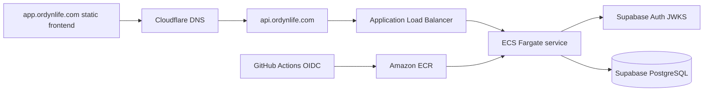

# Backend Deployment Plan

## Status

Historical. The AWS ECS/Fargate backend deployment was implemented, verified,
documented, and then torn down on August 11, 2026 to avoid unnecessary spend for
a local-only backend workflow. The detailed historical runbook, IAM notes,
commands, teardown notes, and rebuild checklist live in
`docs/backend-aws-infrastructure-runbook.md`.

## Current Backend Shape

- FastAPI app: `apps/api/app/main.py`
- Container: `apps/api/Dockerfile`, serving Uvicorn on `PORT` with a default
  of `8000`
- Local container runner: root `docker-compose.yml`
- Health probes: `GET /health` and `GET /ready`
- Smoke script: `apps/api/scripts/smoke_api.py`
- Protected routes: `/api/v1/me`, `/api/v1/tasks`, `/api/v1/workouts`,
  `/api/v1/journal/entries`, `/api/v1/runs`, `/api/v1/dashboard`, and
  `/api/v1/calendar`
- Database migrations: Alembic in `apps/api/alembic`
- Auth: Supabase JWT validation through JWKS

`/health` is a shallow process liveness check. `/ready` verifies required
runtime configuration, production CORS safety, and database connectivity before
reporting readiness.

## Historical Implemented Architecture



Historical production resources:

| Resource            | Value                                                       |
| ------------------- | ----------------------------------------------------------- |
| AWS account         | `575124957640`                                              |
| Region              | `us-east-1`                                                 |
| API domain          | `https://api.ordynlife.com`                                 |
| ECR repository      | `ordyn-life-api`                                            |
| Current image tag   | deleted                                                     |
| ECS cluster         | `ordyn-life`                                                |
| ECS service         | `ordyn-life-api`                                            |
| ECS task definition | deleted                                                     |
| ALB                 | `ordyn-life-api-alb`                                        |
| ALB DNS             | `ordyn-life-api-alb-2123102133.us-east-1.elb.amazonaws.com` |
| Target group        | `ordyn-life-api-tg`                                         |
| Database secret     | `ordyn-life-api/database-url`                               |

## AWS Options And Costs

Cost estimates assume `us-east-1` or another low-cost US region, one production
environment, light portfolio traffic, 730 hours/month, and public AWS pricing
checked during planning. Recheck pricing with AWS Pricing Calculator before
provisioning.

| Option                                  | Fit                          | Estimated monthly cost | Notes                                                                                                                                                                                             |
| --------------------------------------- | ---------------------------- | ---------------------: | ------------------------------------------------------------------------------------------------------------------------------------------------------------------------------------------------- |
| AWS App Runner                          | Not used                     |        About `$5-$30+` | Previously considered, but new App Runner availability limits and the current deployment path led to ECS/Fargate.                                                                                 |
| ECS Fargate + ALB                       | Implemented production path  |       About `$35-$50+` | One `0.25 vCPU / 0.5 GB` task is about `$9/month` on Linux/x86 Fargate before networking. ALB base pricing, low LCU usage, public IPv4 charges, ECR, and CloudWatch logs drive most of the rest.  |
| ECS Fargate + ALB + private subnets/NAT | More isolated network path   |           About `$70+` | Adds NAT Gateway hourly and per-GB processing charges. Use later if private-subnet egress is worth the extra monthly cost.                                                                        |
| Elastic Beanstalk Docker                | Simpler AWS-managed EC2 path |       About `$15-$45+` | Beanstalk itself has no additional charge, but the app still pays for EC2, EBS, public IPv4, logs, and optionally an ALB. Cheapest single-instance setups have more manual TLS and ops tradeoffs. |

Cost drivers to watch:

- Fargate compute: vCPU-hour and GB-hour.
- Application Load Balancer: hourly ALB charge plus LCU usage.
- Public IPv4: charged hourly for in-use and idle public IPv4 addresses.
- NAT Gateway: hourly charge and per-GB processing if private subnet egress is
  used.
- ECR: image storage after free-tier limits and image pulls by the deployment
  service.
- CloudWatch Logs: ingestion and retained storage. Use short retention at first.
- Custom-domain TLS: ACM certificates are free, but the ALB and CloudFront
  distributions using them still incur normal service charges.

## Historical AWS Architecture

The deleted production shape was:

- One ECR private repository: `ordyn-life-api`.
- One ECS cluster: `ordyn-life`.
- One ECS Fargate service: `ordyn-life-api`.
- One internet-facing ALB: `ordyn-life-api-alb`.
- One IP target group on port `8000`: `ordyn-life-api-tg`.
- One HTTP listener on port `80`.
- One HTTPS listener on port `443` using the ACM certificate for
  `api.ordynlife.com`.
- One CloudWatch log group: `/ecs/ordyn-life-api`.
- One Secrets Manager secret for `DATABASE_URL`.
- One ECS task execution role with ECR, CloudWatch Logs, and Secrets Manager
  read permissions for the database secret.

Tasks run in the default VPC public subnets with public IP assignment. The API
security group allows inbound port `8000` only from the ALB security group.

## Historical DNS And TLS

- `api.ordynlife.com` was a CNAME in Cloudflare pointing to the ALB DNS name.
- The ACM certificate for `api.ordynlife.com` was attached to the ALB HTTPS
  listener and was deleted during teardown.
- Start with Cloudflare DNS-only mode for the API until HTTPS is confirmed.
- If Cloudflare proxying is enabled later, use Full Strict TLS and confirm that
  WebSocket and large request behavior still match app needs.

## Environment Variables

Backend production runtime:

```text
ENVIRONMENT=production
CORS_ALLOWED_ORIGINS=["https://app.ordynlife.com"]
DATABASE_URL=<supabase-postgres-or-session-pooler-url>
SUPABASE_URL=https://<project-ref>.supabase.co
SUPABASE_JWKS_URL=
SUPABASE_JWT_ISSUER=
SUPABASE_JWT_AUDIENCE=authenticated
SUPABASE_SERVICE_ROLE_KEY=
```

Notes:

- Leave `SUPABASE_JWKS_URL` and `SUPABASE_JWT_ISSUER` empty unless explicit
  overrides are needed; the app derives them from `SUPABASE_URL`.
- Leave `SUPABASE_SERVICE_ROLE_KEY` unset or empty. It is optional,
  server-side only, and not required by the current backend.
- Store `DATABASE_URL` and any future secret values outside GitHub source
  control.
- Prefer the Supabase connection pooler string for deployed containers unless
  a direct connection is intentionally chosen and tested.

Frontend production build:

```text
NEXT_PUBLIC_API_URL=https://api.ordynlife.com
NEXT_PUBLIC_SUPABASE_URL=https://<project-ref>.supabase.co
NEXT_PUBLIC_SUPABASE_PUBLISHABLE_KEY=<public-publishable-key>
NEXT_PUBLIC_SUPABASE_ANON_KEY=
```

Historical GitHub Actions deployment configuration:

```text
AWS_REGION=us-east-1
AWS_ACCOUNT_ID=575124957640
AWS_ECR_REPOSITORY=ordyn-life-api
AWS_ECS_CLUSTER=ordyn-life
AWS_ECS_SERVICE=ordyn-life-api
AWS_ECS_TASK_FAMILY=ordyn-life-api
AWS_DEPLOY_ROLE_ARN=<github-oidc-role-arn>
```

## CORS Requirements

FastAPI currently enables credentials and allows all methods and headers. For
production, `CORS_ALLOWED_ORIGINS` must be an explicit JSON list and must not
use `*`.

Minimum production origins:

```text
https://app.ordynlife.com
```

Keep `http://localhost:3000` only in local and staging configuration. Add any
preview domain explicitly if a hosted preview environment is introduced.

Supabase Auth settings must also include the deployed frontend URLs:

- Site URL: `https://app.ordynlife.com`
- Redirect URLs: `https://app.ordynlife.com/login` and local development
  redirects as needed.

## Migration Strategy

Migrations must remain an explicit deployment step. Do not run Alembic
automatically on API process startup.

Historical ECS release sequence:

1. Build and test the backend image in CI.
2. Push an immutable image tag to ECR.
3. Run `uv run alembic upgrade head` as a controlled GitHub Actions step or
   one-off job using the same image and production `DATABASE_URL`.
4. Run `uv run alembic check` against the production database.
5. Register a new ECS task definition revision for the new image.
6. Update the ECS service to the new task definition revision.
7. Wait for the ECS service deployment to reach steady state.
8. Confirm target group health is healthy.
9. Run API smoke tests against `https://api.ordynlife.com`.

Before the first production migration, confirm Supabase backups/PITR settings
and take a manual backup if the project tier allows it.

## Verification Checklist

Pre-deployment:

- `make lint`
- `make format-check`
- `make test`
- `make build`
- `make docker-build`
- Local container health check returns `{"status":"ok"}` from `/health`.
- `make docker-smoke` passes against the local backend container.
- `make api-smoke-ready API_BASE_URL=https://api.ordynlife.com` passes after a
  deployed API has production runtime configuration.
- Repository secret scan finds no committed credentials or populated secrets.
- Alembic migration check passes against a configured Supabase database.

Historical AWS infrastructure:

- ECR repository contains the expected immutable image tag.
- ECS service references the expected task definition revision.
- ECS task definition references the expected image digest or tag.
- Runtime secrets come from Secrets Manager or SSM, not source control.
- ALB HTTPS listener is serving the ACM certificate for `api.ordynlife.com`.
- Target group health reports the ECS task healthy on `/health`.
- CloudWatch logs show startup without tracebacks.
- Cloudflare DNS resolves `api.ordynlife.com` to the ALB DNS name.

API smoke tests:

```bash
curl -i https://api.ordynlife.com/health
curl -i https://api.ordynlife.com/ready
curl -i https://api.ordynlife.com/api/v1/me
curl -i -H "Authorization: Bearer invalid" https://api.ordynlife.com/api/v1/me
curl -i -X OPTIONS https://api.ordynlife.com/api/v1/me \
  -H "Origin: https://app.ordynlife.com" \
  -H "Access-Control-Request-Method: GET" \
  -H "Access-Control-Request-Headers: authorization"
```

Expected results:

- `/health` returns `200`.
- `/ready` returns `200` only when required runtime config is present and the
  database responds.
- Missing and invalid bearer tokens return `401`.
- CORS preflight from `https://app.ordynlife.com` returns an
  `access-control-allow-origin` value for that exact origin.
- A valid Supabase access token can read `/api/v1/me`.
- Authenticated task, workout, journal, running, dashboard, and calendar
  requests remain scoped to the JWT subject and cannot read another user's data.

Post-deployment:

- Frontend production build uses `NEXT_PUBLIC_API_URL=https://api.ordynlife.com`.
- Browser login works through Supabase Auth from the deployed frontend.
- Dashboard, running, and calendar workflows work from the deployed frontend.
- CloudWatch alarms or manual checks cover ECS service health, ALB target
  health, custom domain health, and 5xx responses.
- AWS Budgets alert is configured for the expected monthly ceiling.

## Implementation And Teardown

Completed manually:

1. Created ECR repository and pushed the backend image.
2. Created ECS cluster, task execution role, CloudWatch log group, task
   definition, ALB, target group, listeners, and ECS service.
3. Stored `DATABASE_URL` in Secrets Manager and injected it into ECS.
4. Attached the ACM certificate for `api.ordynlife.com` to the ALB HTTPS
   listener.
5. Pointed Cloudflare DNS for `api.ordynlife.com` to the ALB.
6. Verified `/health`, `/ready`, production CORS, and deployed frontend access.

Completed teardown:

1. Scaled the ECS service to `0`.
2. Deleted the ECS service and cluster.
3. Deleted the ALB and target group.
4. Deleted the ECR repository and backend images.
5. Deleted the Secrets Manager database secret and CloudWatch log group.
6. Deleted the backend security groups, backend ACM certificate, ECS execution
   role, and backend GitHub deploy role.
7. Disabled the backend deployment workflow.

## Pricing References

- [AWS Fargate pricing](https://aws.amazon.com/fargate/pricing/)
- [Elastic Load Balancing pricing](https://aws.amazon.com/elasticloadbalancing/pricing/)
- [Amazon VPC pricing](https://aws.amazon.com/vpc/pricing/)
- [AWS App Runner pricing](https://aws.amazon.com/apprunner/pricing/)
- [Elastic Beanstalk pricing](https://docs.aws.amazon.com/elasticbeanstalk/latest/dg/Welcome.html#Welcome.Pricing)
- [Amazon ECR pricing](https://aws.amazon.com/ecr/pricing/)
- [Amazon CloudWatch pricing](https://aws.amazon.com/cloudwatch/pricing/)
- [AWS Certificate Manager pricing](https://aws.amazon.com/certificate-manager/pricing/)
