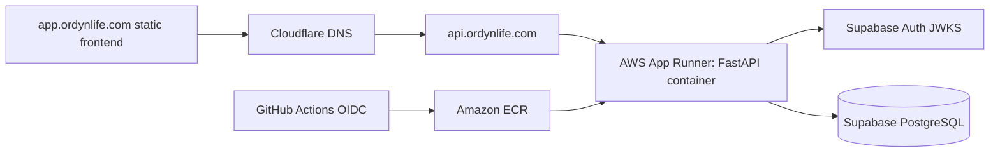

# Backend Deployment Plan

## Status

Planned. The FastAPI backend is Dockerized and CI builds the image, but
`api.ordynlife.com` is not deployed yet. This plan defines the backend
deployment milestone without creating cloud resources, credentials, or
deployment automation. Milestone 8 Calendar is completed before this backend
deployment milestone begins.

## Current Backend Shape

- FastAPI app: `apps/api/app/main.py`
- Container: `apps/api/Dockerfile`, serving Uvicorn on port `8000`
- Local container runner: root `docker-compose.yml`
- Health probes: `GET /health` and `GET /ready`
- Protected routes: `/api/v1/me`, `/api/v1/tasks`, `/api/v1/workouts`,
  `/api/v1/journal/entries`, `/api/v1/runs`, `/api/v1/dashboard`, and
  `/api/v1/calendar`
- Database migrations: Alembic in `apps/api/alembic`
- Auth: Supabase JWT validation through JWKS

`/health` is a shallow process liveness check. `/ready` verifies required
runtime configuration and database connectivity before reporting readiness.

## Recommendation

Use **AWS App Runner** for the first production deployment of
`api.ordynlife.com`.

This matches the existing Docker decision, avoids managing an Application Load
Balancer, ECS service, target groups, and most VPC networking, and should keep
monthly cost lower for light portfolio traffic. Keep ECS/Fargate as a later
upgrade path if the app needs more infrastructure control.



## AWS Options And Costs

Cost estimates assume `us-east-1` or another low-cost US region, one production
environment, light portfolio traffic, 730 hours/month, and public AWS pricing
checked during planning. Recheck pricing with AWS Pricing Calculator before
provisioning.

| Option | Fit | Estimated monthly cost | Notes |
| --- | --- | ---: | --- |
| AWS App Runner | Recommended lowest-ops path | About `$5-$30+` | Avoids a dedicated ALB and most ECS/VPC setup. Cost depends on instance size, minimum instance count, idle memory charges, and request volume. |
| ECS Fargate + ALB | Production-style upgrade path | About `$35-$50+` | One `0.25 vCPU / 0.5 GB` task is about `$9/month` on Linux/x86 Fargate before networking. ALB base pricing, low LCU usage, public IPv4 charges, ECR, and CloudWatch logs drive most of the rest. |
| ECS Fargate + ALB + private subnets/NAT | More isolated network path | About `$70+` | Adds NAT Gateway hourly and per-GB processing charges. Use later if private-subnet egress is worth the extra monthly cost. |
| Elastic Beanstalk Docker | Simpler AWS-managed EC2 path | About `$15-$45+` | Beanstalk itself has no additional charge, but the app still pays for EC2, EBS, public IPv4, logs, and optionally an ALB. Cheapest single-instance setups have more manual TLS and ops tradeoffs. |

Cost drivers to watch:

- App Runner provisioned compute and request processing.
- Fargate compute: vCPU-hour and GB-hour, if ECS is chosen later.
- Application Load Balancer: hourly ALB charge plus LCU usage.
- Public IPv4: charged hourly for in-use and idle public IPv4 addresses.
- NAT Gateway: hourly charge and per-GB processing if private subnet egress is
  used.
- ECR: image storage after free-tier limits and image pulls by the deployment
  service.
- CloudWatch Logs: ingestion and retained storage. Use short retention at first.
- Custom-domain TLS: App Runner manages HTTPS for the associated custom domain;
  ALB-attached ACM certificates apply only if ECS/Fargate is chosen later.

## Target AWS Architecture

Provision the minimum production shape:

- One ECR private repository, for example `ordyn-life-api`.
- One App Runner service using the ECR image and port `8000`.
- Health check path `/health`, with `/ready` reserved for dependency readiness
  and smoke verification.
- One App Runner custom domain association for `api.ordynlife.com`.
- Cloudflare DNS records required by the App Runner custom domain flow.
- CloudWatch log group with 7-14 day retention during the portfolio phase.
- AWS Secrets Manager or SSM Parameter Store for runtime secrets.
- GitHub Actions OIDC role for future deployment automation.

Avoid a VPC connector for the first deployment unless Supabase connectivity
requires it. A VPC connector can add networking complexity and may reintroduce
NAT-style costs depending on the final network design.

## DNS And TLS

- `api.ordynlife.com` should be associated as an App Runner custom domain.
- Configure the Cloudflare DNS records App Runner provides for domain
  validation and traffic routing.
- Start with Cloudflare DNS-only mode for the API until App Runner custom domain
  validation and HTTPS are confirmed.
- If Cloudflare proxying is enabled later, use Full Strict TLS and confirm that
  WebSocket and large request behavior still match app needs.

## Environment Variables

Backend production runtime:

```text
ENVIRONMENT=production
CORS_ALLOWED_ORIGINS=["https://app.ordynlife.com"]
DATABASE_URL=<supabase-postgres-or-session-pooler-url>
SUPABASE_URL=https://<project-ref>.supabase.co
SUPABASE_JWKS_URL=
SUPABASE_JWT_ISSUER=
SUPABASE_JWT_AUDIENCE=authenticated
SUPABASE_SERVICE_ROLE_KEY=
```

Notes:

- Leave `SUPABASE_JWKS_URL` and `SUPABASE_JWT_ISSUER` empty unless explicit
  overrides are needed; the app derives them from `SUPABASE_URL`.
- Leave `SUPABASE_SERVICE_ROLE_KEY` unset or empty. It is optional,
  server-side only, and not required by the current backend.
- Store `DATABASE_URL` and any future secret values outside GitHub source
  control.
- Prefer the Supabase connection pooler string for deployed containers unless
  a direct connection is intentionally chosen and tested.

Frontend production build:

```text
NEXT_PUBLIC_API_URL=https://api.ordynlife.com
NEXT_PUBLIC_SUPABASE_URL=https://<project-ref>.supabase.co
NEXT_PUBLIC_SUPABASE_PUBLISHABLE_KEY=<public-publishable-key>
NEXT_PUBLIC_SUPABASE_ANON_KEY=
```

Future GitHub Actions deployment configuration:

```text
AWS_REGION=us-east-1
AWS_ACCOUNT_ID=<account-id>
AWS_ECR_REPOSITORY=ordyn-life-api
AWS_APP_RUNNER_SERVICE_ARN=<service-arn>
AWS_DEPLOY_ROLE_ARN=<github-oidc-role-arn>
```

## CORS Requirements

FastAPI currently enables credentials and allows all methods and headers. For
production, `CORS_ALLOWED_ORIGINS` must be an explicit JSON list and must not
use `*`.

Minimum production origins:

```text
https://app.ordynlife.com
```

Keep `http://localhost:3000` only in local and staging configuration. Add any
preview domain explicitly if a hosted preview environment is introduced.

Supabase Auth settings must also include the deployed frontend URLs:

- Site URL: `https://app.ordynlife.com`
- Redirect URLs: `https://app.ordynlife.com/login` and local development
  redirects as needed.

## Migration Strategy

Migrations must remain an explicit deployment step. Do not run Alembic
automatically on API process startup.

Release sequence:

1. Build and test the backend image in CI.
2. Push an immutable image tag to ECR.
3. Run `uv run alembic upgrade head` as a controlled GitHub Actions step or
   one-off job using the same image and production `DATABASE_URL`.
4. Run `uv run alembic check` against the production database.
5. Trigger an App Runner deployment for the new image.
6. Wait for the App Runner service to become running and healthy.
7. Run API smoke tests against `https://api.ordynlife.com`.

Before the first production migration, confirm Supabase backups/PITR settings
and take a manual backup if the project tier allows it.

## Verification Checklist

Pre-deployment:

- `make lint`
- `make format-check`
- `make test`
- `make build`
- `make docker-build`
- Local container health check returns `{"status":"ok"}` from `/health`.
- Repository secret scan finds no committed credentials or populated secrets.
- Alembic migration check passes against a configured Supabase database.

AWS infrastructure:

- ECR repository contains the expected immutable image tag.
- App Runner service references the expected image digest or tag.
- Runtime secrets come from Secrets Manager or SSM, not source control.
- App Runner custom domain is validated and serving HTTPS for
  `api.ordynlife.com`.
- App Runner health checks report the service healthy on `/health`.
- CloudWatch logs show startup without tracebacks.
- Cloudflare DNS resolves `api.ordynlife.com` through the App Runner custom
  domain records.

API smoke tests:

```bash
curl -i https://api.ordynlife.com/health
curl -i https://api.ordynlife.com/ready
curl -i https://api.ordynlife.com/api/v1/me
curl -i -H "Authorization: Bearer invalid" https://api.ordynlife.com/api/v1/me
curl -i -X OPTIONS https://api.ordynlife.com/api/v1/me \
  -H "Origin: https://app.ordynlife.com" \
  -H "Access-Control-Request-Method: GET" \
  -H "Access-Control-Request-Headers: authorization"
```

Expected results:

- `/health` returns `200`.
- `/ready` returns `200` only when required runtime config is present and the
  database responds.
- Missing and invalid bearer tokens return `401`.
- CORS preflight from `https://app.ordynlife.com` returns an
  `access-control-allow-origin` value for that exact origin.
- A valid Supabase access token can read `/api/v1/me`.
- Authenticated task, workout, journal, running, dashboard, and calendar
  requests remain scoped to the JWT subject and cannot read another user's data.

Post-deployment:

- Frontend production build uses `NEXT_PUBLIC_API_URL=https://api.ordynlife.com`.
- Browser login works through Supabase Auth from the deployed frontend.
- Dashboard, running, and calendar workflows work from the deployed frontend.
- CloudWatch alarms or manual checks cover App Runner service health, custom
  domain health, and 5xx responses.
- AWS Budgets alert is configured for the expected monthly ceiling.

## Implementation Tasks

1. Add production readiness checks for `DATABASE_URL` and Supabase auth config,
   plus database connectivity.
2. Define infrastructure as code or documented console steps for ECR, App
   Runner, IAM, logs, and DNS handoff notes.
3. Add manual GitHub Actions deployment using OIDC, ECR push, explicit
   migration, App Runner deployment, and smoke tests.
4. Configure production environment values in AWS and frontend build settings.
5. Run the first migration against Supabase production.
6. Deploy the API and complete the verification checklist.

## Pricing References

- [AWS Fargate pricing](https://aws.amazon.com/fargate/pricing/)
- [Elastic Load Balancing pricing](https://aws.amazon.com/elasticloadbalancing/pricing/)
- [Amazon VPC pricing](https://aws.amazon.com/vpc/pricing/)
- [AWS App Runner pricing](https://aws.amazon.com/apprunner/pricing/)
- [Elastic Beanstalk pricing](https://docs.aws.amazon.com/elasticbeanstalk/latest/dg/Welcome.html#Welcome.Pricing)
- [Amazon ECR pricing](https://aws.amazon.com/ecr/pricing/)
- [Amazon CloudWatch pricing](https://aws.amazon.com/cloudwatch/pricing/)
- [AWS Certificate Manager pricing](https://aws.amazon.com/certificate-manager/pricing/)
