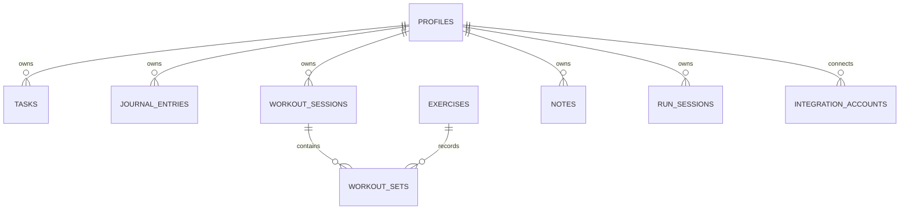

# Database Schema

## Status

The production database is Supabase PostgreSQL. Alembic is the schema source
of truth. Milestone 7 added user-owned run sessions after journal entries.
Milestone 8 Calendar is a read-only aggregation feature and does not add a new
persistence table.

Alembic will be the source of truth for schema changes beginning when the first
persisted feature is implemented.

Foreign keys to Supabase-managed `auth.users` are defined explicitly in
migrations. Alembic target metadata includes the expected ownership constraints
while excluding the externally managed Auth table itself from autogeneration.

## Ownership Rule

Every user-owned table includes `user_id`. Backend queries must filter by the
authenticated user identifier, including reads, updates, and deletes.

## Planned Tables

| Table | Purpose | Planned milestone |
| --- | --- | --- |
| `profiles` | Application profile linked to Supabase Auth (implemented) | 2 |
| `tasks` | User task management (implemented) | 3 |
| `exercises` | Shared and user-created exercise catalog (implemented) | 4 |
| `workout_plans` | Shared and user-created workout rotations (implemented) | 4 |
| `workout_plan_days` | Ordered training and rest days (implemented) | 4 |
| `workout_plan_exercises` | Ordered exercise prescriptions (implemented) | 4 |
| `workout_sessions` | Generated gym workout sessions (implemented) | 4 |
| `workout_sets` | Sets recorded within sessions (implemented) | 4 |
| `journal_entries` | Dated journal entries (implemented) | 5 |
| `notes` | General notes and tags | 10 |
| `run_sessions` | Running activity records (implemented) | 7 |
| `integration_accounts` | Future provider connections | 11 |

## Planned Relationships

Detailed columns, constraints, indexes, delete behavior, and migration strategy
will be finalized with each feature. This avoids committing to unused schema
before its behavior is implemented and tested.

## Profiles

| Column | Type | Notes |
| --- | --- | --- |
| `id` | UUID | Primary key |
| `user_id` | UUID | Unique foreign key to `auth.users.id` |
| `display_name` | varchar(80) | Optional |
| `timezone` | varchar(64) | Defaults to `UTC` |
| `locale` | varchar(10) | `en-US` or `pt-BR` at the API boundary |
| `created_at` | timestamptz | Creation timestamp |
| `updated_at` | timestamptz | Last application update timestamp |

The migration enables Row Level Security on `profiles`. No Data API policies
are added because application data is accessed through FastAPI.

## Tasks

| Column | Type | Notes |
| --- | --- | --- |
| `id` | UUID | Primary key |
| `user_id` | UUID | Foreign key to `auth.users.id`; ownership boundary |
| `title` | varchar(200) | Required |
| `description` | text | Optional |
| `due_at` | timestamptz | Optional |
| `priority` | varchar(10) | `low`, `medium`, or `high` |
| `completed_at` | timestamptz | Null while open |
| `created_at` | timestamptz | Creation timestamp |
| `updated_at` | timestamptz | Last application update timestamp |

Indexes support user-scoped creation-order and completion-state queries. RLS is
enabled as defense in depth; FastAPI remains the application data boundary.

## Gym Workouts

The exercise catalog mixes shared built-ins (`user_id` is null) with user-owned
custom exercises. Workout plans follow the same ownership pattern. The seeded
shared U/L/Rest starter split is read-only and clonable.

Starting a training day creates a user-owned `workout_sessions` row and
pre-generates ordered `workout_sets`. Exercise names are copied into sets so
historical sessions remain understandable if a custom plan changes later.
Failure prescriptions are also snapshotted separately from the user's recorded
result. A partial unique index permits only one active session per user.

## Journal Entries

| Column | Type | Notes |
| --- | --- | --- |
| `id` | UUID | Primary key |
| `user_id` | UUID | Foreign key to `auth.users.id`; ownership boundary |
| `entry_date` | date | User's local calendar date |
| `title` | varchar(200) | Optional |
| `content` | text | Required, maximum 50,000 characters at the API boundary |
| `created_at` | timestamptz | Creation timestamp |
| `updated_at` | timestamptz | Last application update timestamp |

A unique constraint on `(user_id, entry_date)` guarantees one entry per user
per local calendar date. RLS is enabled as defense in depth; FastAPI remains
the application data boundary.

## Run Sessions

| Column | Type | Notes |
| --- | --- | --- |
| `id` | UUID | Primary key |
| `user_id` | UUID | Foreign key to `auth.users.id`; ownership boundary |
| `started_at` | timestamptz | Date and time of the run |
| `distance_km` | numeric(7,2) | Positive distance in kilometers |
| `duration_seconds` | integer | Positive elapsed duration |
| `notes` | text | Optional |
| `created_at` | timestamptz | Creation timestamp |
| `updated_at` | timestamptz | Last application update timestamp |

Pace is calculated from distance and duration rather than persisted. RLS is
enabled as defense in depth; FastAPI remains the application data boundary.

## Calendar

Calendar is intentionally not represented by its own table in Milestone 8. It
reads existing user-owned task due dates, workout session timestamps, run
session timestamps, and journal entry dates through FastAPI-scoped queries.
Standalone events, recurrence rules, reminders, and external calendar sync
remain future behavior.
