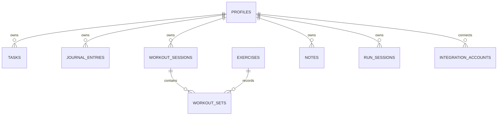

# Database Schema

## Status

The production database will be Supabase PostgreSQL. This document records the
planned schema; Milestone 1 creates no tables or migrations.

Alembic will be the source of truth for schema changes beginning when the first
persisted feature is implemented.

## Ownership Rule

Every user-owned table includes `user_id`. Backend queries must filter by the
authenticated user identifier, including reads, updates, and deletes.

## Planned Tables

| Table | Purpose | Planned milestone |
| --- | --- | --- |
| `profiles` | Application profile linked to Supabase Auth | 2 |
| `tasks` | User task management | 3 |
| `exercises` | Shared and user-created exercise catalog | 4 |
| `workout_sessions` | Gym workout sessions | 4 |
| `workout_sets` | Sets recorded within sessions | 4 |
| `journal_entries` | Dated journal entries | 5 |
| `notes` | General notes and tags | 9 |
| `run_sessions` | Running activity records | 9 |
| `integration_accounts` | Future provider connections | 10 |

## Planned Relationships

Detailed columns, constraints, indexes, delete behavior, and migration strategy
will be finalized with each feature. This avoids committing to unused schema
before its behavior is implemented and tested.
