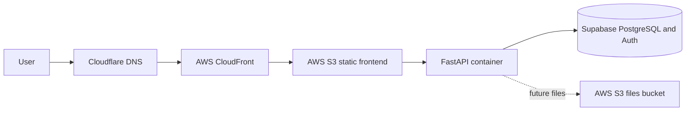

# Deployment

## Status

The static frontend is configured for manual deployment to AWS S3 and
CloudFront with Cloudflare managing DNS for `app.ordynlife.com`. The repository
includes a backend Dockerfile, a local Compose service, Alembic migrations, and
CI image-build validation. Backend cloud deployment and automated deployment
workflows are not active yet.

The concrete backend deployment plan for `api.ordynlife.com` is documented in
[backend-deployment-plan.md](backend-deployment-plan.md).

## Option A

### Frontend

The Next.js frontend is designed for static export, uploaded to a private S3
bucket, and served through CloudFront. Cloudflare manages the domain and DNS.
CloudFront provides CDN delivery and HTTPS at the AWS edge.

Server-only Next.js features must not be introduced without reconsidering the
static hosting decision.

Current manual deployment notes:

- Build from `apps/web` with `npm run build`.
- Upload the contents of `apps/web/out/` to the S3 bucket root, including the
  generated `_next/` assets directory.
- Keep the S3 bucket private and serve it through CloudFront.
- Use a CloudFront default root object of `index.html`.
- Rewrite clean static routes such as `/dashboard` to `/dashboard.html` at the
  CloudFront viewer request layer.
- Create a CloudFront invalidation for `/*` after replacing deployed files.

### Backend

FastAPI runs in a Docker container locally. The image serves Uvicorn on the
configured `PORT`, exposes a Docker healthcheck against `/health`, and can be
smoke-tested with `make docker-smoke`. The planned production target for
`api.ordynlife.com` is AWS App Runner, chosen as the first backend host because
it avoids running a separate Application Load Balancer and keeps operations
small for low portfolio traffic. ECS/Fargate remains a future upgrade path if
the app needs more infrastructure control.

S3 cannot execute the backend.

### CI/CD

Pull requests and pushes to `main` run frontend lint, typecheck, formatting, and
static build checks, plus backend lint, formatting, tests, and Docker image
builds. Main-branch deployment will later use GitHub Actions and AWS OIDC rather
than long-lived AWS keys. The current deployment workflows remain manual-only
placeholders.

Migrations must be run as an explicit, observable deployment step before code
that requires the new schema receives traffic.
