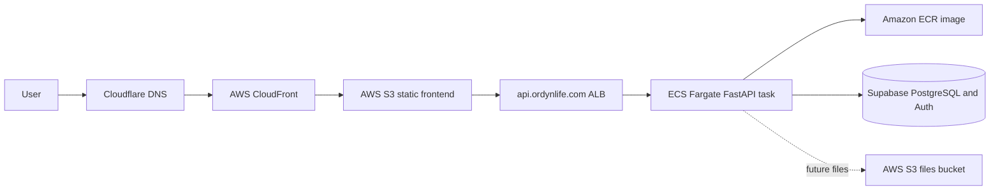

# Deployment

## Status

Ordyn Life is deployed with a static frontend on AWS S3 and CloudFront, DNS in
Cloudflare, and a Dockerized FastAPI backend on AWS ECS/Fargate behind an
Application Load Balancer.

Frontend deployment is automated with GitHub Actions. Backend deployment is
currently manual. CI validates builds and tests, but the repository does not yet
contain an automated backend production deployment workflow.

## Option A



### Frontend

The Next.js frontend is designed for static export, uploaded to a private S3
bucket, and served through CloudFront. Cloudflare manages the domain and DNS.
CloudFront provides CDN delivery and HTTPS at the AWS edge.

Server-only Next.js features must not be introduced without reconsidering the
static hosting decision.

Current production values:

- Domain: `https://app.ordynlife.com`
- S3 bucket: `ordynlife-web-prod`
- CloudFront distribution: `ES1QWM89S2DUQ`
- Production API URL: `https://api.ordynlife.com`

Automated frontend deployment:

- Workflow: `.github/workflows/deploy-web.yml`
- Triggers: pushes to `main` that touch `apps/web/**` or the workflow file, and
  manual `workflow_dispatch`
- Build output: `apps/web/out/`
- Upload target: `s3://ordynlife-web-prod`
- Cache invalidation: CloudFront distribution `ES1QWM89S2DUQ`

The workflow runs frontend lint, typecheck, format check, static build, S3 sync,
CloudFront invalidation, and smoke checks for the deployed frontend and API.

Required GitHub repository variables:

```text
AWS_DEPLOY_ROLE_ARN=arn:aws:iam::575124957640:role/ordyn-life-github-web-deploy-role
NEXT_PUBLIC_SUPABASE_URL=<supabase-project-url>
NEXT_PUBLIC_SUPABASE_PUBLISHABLE_KEY=<supabase-public-publishable-key>
NEXT_PUBLIC_SUPABASE_ANON_KEY=
```

These variables are configured under GitHub repository settings:
**Settings > Secrets and variables > Actions > Variables**.

Configured AWS OIDC resources:

- Identity provider:
  `arn:aws:iam::575124957640:oidc-provider/token.actions.githubusercontent.com`
- Deploy role:
  `arn:aws:iam::575124957640:role/ordyn-life-github-web-deploy-role`
- Trust scope:
  `repo:vini-araujo/Productivity-App:ref:refs/heads/main`

The deploy role should be assumable through GitHub Actions OIDC and should have
least-privilege access to sync the frontend bucket and invalidate the CloudFront
distribution:

```json
{
  "Version": "2012-10-17",
  "Statement": [
    {
      "Effect": "Allow",
      "Action": ["s3:ListBucket"],
      "Resource": "arn:aws:s3:::ordynlife-web-prod"
    },
    {
      "Effect": "Allow",
      "Action": ["s3:GetObject", "s3:PutObject", "s3:DeleteObject"],
      "Resource": "arn:aws:s3:::ordynlife-web-prod/*"
    },
    {
      "Effect": "Allow",
      "Action": ["cloudfront:CreateInvalidation", "cloudfront:GetInvalidation"],
      "Resource": "arn:aws:cloudfront::575124957640:distribution/ES1QWM89S2DUQ"
    }
  ]
}
```

Manual frontend deployment, if the workflow is unavailable:

```powershell
cd "C:\Users\Orang\OneDrive\Desktop\Productivity App\apps\web"
npm.cmd run build
& "C:\Program Files\Amazon\AWSCLIV2\aws.exe" s3 sync `
  "C:\Users\Orang\OneDrive\Desktop\Productivity App\apps\web\out" `
  "s3://ordynlife-web-prod" `
  --delete
& "C:\Program Files\Amazon\AWSCLIV2\aws.exe" cloudfront create-invalidation `
  --distribution-id ES1QWM89S2DUQ `
  --paths "/*"
```

Build-time frontend environment must include:

```text
NEXT_PUBLIC_API_URL=https://api.ordynlife.com
NEXT_PUBLIC_SUPABASE_URL=<supabase-project-url>
NEXT_PUBLIC_SUPABASE_PUBLISHABLE_KEY=<supabase-public-publishable-key>
NEXT_PUBLIC_SUPABASE_ANON_KEY=
```

### Backend

FastAPI runs as a Docker container on ECS/Fargate. The image serves Uvicorn on
`PORT=8000`, exposes `/health` for liveness, and exposes `/ready` for
configuration and database readiness.

Current production values:

- Domain: `https://api.ordynlife.com`
- AWS region: `us-east-1`
- ECR repository: `ordyn-life-api`
- Image tag currently deployed: `0611135`
- ECS cluster: `ordyn-life`
- ECS service: `ordyn-life-api`
- ECS task definition family: `ordyn-life-api`
- Current production task definition: `ordyn-life-api:4`
- ALB: `ordyn-life-api-alb`
- ALB DNS name: `ordyn-life-api-alb-2123102133.us-east-1.elb.amazonaws.com`
- Target group: `ordyn-life-api-tg`
- HTTPS certificate: ACM certificate for `api.ordynlife.com`
- Database secret: AWS Secrets Manager secret `ordyn-life-api/database-url`

Runtime environment:

```text
ENVIRONMENT=production
PORT=8000
CORS_ALLOWED_ORIGINS=["https://app.ordynlife.com"]
SUPABASE_URL=<supabase-project-url>
SUPABASE_JWKS_URL=<optional-explicit-jwks-url>
SUPABASE_JWT_AUDIENCE=authenticated
DATABASE_URL=<injected from Secrets Manager>
```

Do not commit runtime secrets. `DATABASE_URL` is injected through the ECS
container `secrets` field from Secrets Manager.

Manual backend image deployment, after code changes:

```powershell
docker build -t ordyn-life-api -f apps/api/Dockerfile apps/api
& "C:\Program Files\Amazon\AWSCLIV2\aws.exe" ecr get-login-password `
  --region us-east-1 |
  docker login `
    --username AWS `
    --password-stdin 575124957640.dkr.ecr.us-east-1.amazonaws.com
docker tag ordyn-life-api:latest `
  575124957640.dkr.ecr.us-east-1.amazonaws.com/ordyn-life-api:<git-sha>
docker push `
  575124957640.dkr.ecr.us-east-1.amazonaws.com/ordyn-life-api:<git-sha>
```

After pushing a new image, register a new ECS task definition revision with the
new immutable image tag and update the ECS service to that revision.

S3 cannot execute the backend; it hosts only the static frontend.

### DNS And TLS

Cloudflare manages DNS:

- `app.ordynlife.com` points to CloudFront.
- `api.ordynlife.com` is a CNAME to the API ALB DNS name.

ACM manages TLS:

- `app.ordynlife.com` uses the CloudFront certificate.
- `api.ordynlife.com` uses an ACM certificate attached to the ALB HTTPS
  listener on port `443`.

Keep the API DNS record in Cloudflare DNS-only mode unless Cloudflare proxying
is intentionally tested with the ALB certificate and SSL/TLS mode.

### Verification

Production smoke checks:

```powershell
Invoke-WebRequest -Uri "https://api.ordynlife.com/health" -UseBasicParsing
Invoke-WebRequest -Uri "https://api.ordynlife.com/ready" -UseBasicParsing
```

Expected API results:

```text
/health -> {"status":"ok"}
/ready -> {"status":"ready"}
```

CORS should allow `https://app.ordynlife.com` and block local preview origins in
production mode.

### CI/CD

Pull requests and pushes to `main` run frontend lint, typecheck, formatting, and
static build checks, plus backend lint, formatting, tests, and Docker image
builds. Frontend pushes to `main` deploy through GitHub Actions and AWS OIDC
rather than long-lived AWS keys. Backend deployment will later use GitHub
Actions and AWS OIDC for ECR image push, explicit migrations, ECS task
definition registration, ECS service update, and smoke tests.

Migrations must be run as an explicit, observable deployment step before code
that requires the new schema receives traffic.
