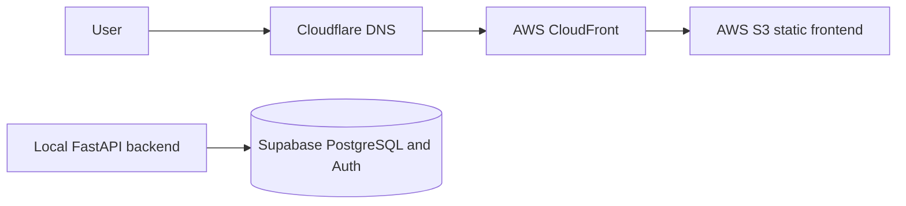

# Deployment

## Status

Ordyn Life currently keeps the static frontend deployed on AWS S3 and
CloudFront, with DNS in Cloudflare.

The AWS backend deployment was built and documented, then torn down to avoid
unnecessary cost for a personal/local-only backend workflow. Frontend deployment
remains automated with GitHub Actions.

## Option A



### Frontend

The Next.js frontend is designed for static export, uploaded to a private S3
bucket, and served through CloudFront. Cloudflare manages the domain and DNS.
CloudFront provides CDN delivery and HTTPS at the AWS edge.

Server-only Next.js features must not be introduced without reconsidering the
static hosting decision.

Current production values:

- Domain: `https://app.ordynlife.com`
- S3 bucket: `ordynlife-web-prod`
- CloudFront distribution: `ES1QWM89S2DUQ`
- Production API URL: `http://localhost:8000`

Automated frontend deployment:

- Workflow: `.github/workflows/deploy-web.yml`
- Triggers: pushes to `main` that touch `apps/web/**` or the workflow file, and
  manual `workflow_dispatch`
- Build output: `apps/web/out/`
- Upload target: `s3://ordynlife-web-prod`
- Cache invalidation: CloudFront distribution `ES1QWM89S2DUQ`

The workflow runs frontend lint, typecheck, format check, static build, S3 sync,
CloudFront invalidation, and a smoke check for the deployed frontend.

Required GitHub repository variables:

```text
AWS_DEPLOY_ROLE_ARN=arn:aws:iam::575124957640:role/ordyn-life-github-web-deploy-role
NEXT_PUBLIC_SUPABASE_URL=<supabase-project-url>
NEXT_PUBLIC_SUPABASE_PUBLISHABLE_KEY=<supabase-public-publishable-key>
NEXT_PUBLIC_SUPABASE_ANON_KEY=
```

These variables are configured under GitHub repository settings:
**Settings > Secrets and variables > Actions > Variables**.

Configured AWS OIDC resources:

- Identity provider:
  `arn:aws:iam::575124957640:oidc-provider/token.actions.githubusercontent.com`
- Deploy role:
  `arn:aws:iam::575124957640:role/ordyn-life-github-web-deploy-role`
- Trust scope:
  `repo:vini-araujo/Productivity-App:ref:refs/heads/main`

The deploy role should be assumable through GitHub Actions OIDC and should have
least-privilege access to sync the frontend bucket and invalidate the CloudFront
distribution:

```json
{
  "Version": "2012-10-17",
  "Statement": [
    {
      "Effect": "Allow",
      "Action": ["s3:ListBucket"],
      "Resource": "arn:aws:s3:::ordynlife-web-prod"
    },
    {
      "Effect": "Allow",
      "Action": ["s3:GetObject", "s3:PutObject", "s3:DeleteObject"],
      "Resource": "arn:aws:s3:::ordynlife-web-prod/*"
    },
    {
      "Effect": "Allow",
      "Action": ["cloudfront:CreateInvalidation", "cloudfront:GetInvalidation"],
      "Resource": "arn:aws:cloudfront::575124957640:distribution/ES1QWM89S2DUQ"
    }
  ]
}
```

Manual frontend deployment, if the workflow is unavailable:

```powershell
cd "C:\Users\Orang\OneDrive\Desktop\Productivity App\apps\web"
npm.cmd run build
& "C:\Program Files\Amazon\AWSCLIV2\aws.exe" s3 sync `
  "C:\Users\Orang\OneDrive\Desktop\Productivity App\apps\web\out" `
  "s3://ordynlife-web-prod" `
  --delete
& "C:\Program Files\Amazon\AWSCLIV2\aws.exe" cloudfront create-invalidation `
  --distribution-id ES1QWM89S2DUQ `
  --paths "/*"
```

Build-time frontend environment must include:

```text
NEXT_PUBLIC_API_URL=http://localhost:8000
NEXT_PUBLIC_SUPABASE_URL=<supabase-project-url>
NEXT_PUBLIC_SUPABASE_PUBLISHABLE_KEY=<supabase-public-publishable-key>
NEXT_PUBLIC_SUPABASE_ANON_KEY=
```

### Backend

FastAPI is currently intended to run locally. The previous AWS ECS/Fargate
backend deployment has been torn down to avoid unnecessary spend.

Historical AWS backend setup details, commands, IAM notes, and teardown guidance
are recorded in `docs/backend-aws-infrastructure-runbook.md`.

Historical production values, deleted during backend teardown:

- Domain: `https://api.ordynlife.com`
- AWS region: `us-east-1`
- ECR repository: `ordyn-life-api`
- Image tag currently deployed: deleted
- ECS cluster: `ordyn-life`
- ECS service: `ordyn-life-api`
- ECS task definition family: `ordyn-life-api`
- Current production task definition: deleted
- ALB: `ordyn-life-api-alb`
- ALB DNS name: `ordyn-life-api-alb-2123102133.us-east-1.elb.amazonaws.com`
- Target group: `ordyn-life-api-tg`
- HTTPS certificate: ACM certificate for `api.ordynlife.com`
- Database secret: AWS Secrets Manager secret `ordyn-life-api/database-url`

Runtime environment:

```text
ENVIRONMENT=production
PORT=8000
CORS_ALLOWED_ORIGINS=["https://app.ordynlife.com"]
SUPABASE_URL=<supabase-project-url>
SUPABASE_JWKS_URL=<optional-explicit-jwks-url>
SUPABASE_JWT_AUDIENCE=authenticated
DATABASE_URL=<injected from Secrets Manager>
```

Do not commit runtime secrets. `DATABASE_URL` is injected through the ECS
container `secrets` field from Secrets Manager.

Backend deployment automation:

- Workflow: `.github/workflows/deploy-api.yml`
- Status: disabled after AWS backend teardown
- Trigger: manual `workflow_dispatch`, but the deploy job is disabled with
  `if: ${{ false }}`
- Image target: `575124957640.dkr.ecr.us-east-1.amazonaws.com/ordyn-life-api`
- Image tag: the full Git commit SHA
- Migration strategy: one-off ECS Fargate task using the same Secrets Manager
  `DATABASE_URL` injection as the API service
- Service update: new ECS task definition revision for `ordyn-life-api`

The workflow runs backend dependency install, lint, format check, tests, image
build, ECR push, migration task registration, Alembic upgrade/check, service
task definition registration, ECS service update, steady-state wait, and smoke
checks for `/health`, `/ready`, and unauthenticated `/api/v1/me`.

Required GitHub repository variables:

```text
AWS_API_DEPLOY_ROLE_ARN=arn:aws:iam::575124957640:role/ordyn-life-github-api-deploy-role
```

Configured AWS OIDC resources:

- Identity provider:
  `arn:aws:iam::575124957640:oidc-provider/token.actions.githubusercontent.com`
- Deploy role:
  `arn:aws:iam::575124957640:role/ordyn-life-github-api-deploy-role`
- Trust scope:
  `repo:vini-araujo/Productivity-App:ref:refs/heads/main`

The backend deploy role should be assumable through GitHub Actions OIDC and
should have least-privilege access for ECR image push, ECS task definition
registration, ECS service updates, one-off ECS migration task runs, and
`iam:PassRole` for `ordyn-life-ecs-task-execution-role`.

Manual backend image deployment, if the workflow is unavailable:

```powershell
docker build -t ordyn-life-api -f apps/api/Dockerfile apps/api
& "C:\Program Files\Amazon\AWSCLIV2\aws.exe" ecr get-login-password `
  --region us-east-1 |
  docker login `
    --username AWS `
    --password-stdin 575124957640.dkr.ecr.us-east-1.amazonaws.com
docker tag ordyn-life-api:latest `
  575124957640.dkr.ecr.us-east-1.amazonaws.com/ordyn-life-api:<git-sha>
docker push `
  575124957640.dkr.ecr.us-east-1.amazonaws.com/ordyn-life-api:<git-sha>
```

After pushing a new image manually, run migrations, register a new ECS task
definition revision with the new immutable image tag, and update the ECS service
to that revision.

S3 cannot execute the backend; it hosts only the static frontend.

### Low-Cost Backend Mode

For personal testing, the frontend can stay online while the backend ECS task is
paused. This was used briefly before the AWS backend resources were deleted.

Check backend status:

```powershell
.\infra\aws\backend-service.ps1 status
```

Pause the backend service:

```powershell
.\infra\aws\backend-service.ps1 pause
```

Resume the backend service:

```powershell
.\infra\aws\backend-service.ps1 resume
```

After teardown, `https://api.ordynlife.com` should not be expected to serve the
API. Rebuild the backend AWS resources before testing a deployed backend.

This pause/resume mode is now historical because the backend AWS resources have
been removed.

### DNS And TLS

Cloudflare manages DNS:

- `app.ordynlife.com` points to CloudFront.
- The previous `api.ordynlife.com` record was removed after backend teardown.

ACM manages TLS:

- `app.ordynlife.com` uses the CloudFront certificate.
- The previous backend ACM certificate for `api.ordynlife.com` was deleted.

### Verification

Local backend smoke checks:

```powershell
Invoke-WebRequest -Uri "http://localhost:8000/health" -UseBasicParsing
Invoke-WebRequest -Uri "http://localhost:8000/ready" -UseBasicParsing
```

Expected API results:

```text
/health -> {"status":"ok"}
/ready -> {"status":"ready"}
```

CORS should allow the local frontend origin while developing locally.

### CI/CD

Pull requests and pushes to `main` run frontend lint, typecheck, formatting, and
static build checks, plus backend lint, formatting, tests, and Docker image
builds. Frontend pushes to `main` deploy through GitHub Actions and AWS OIDC
rather than long-lived AWS keys. Backend deployment is disabled until backend
cloud hosting is intentionally rebuilt.

Migrations must be run as an explicit, observable deployment step before code
that requires the new schema receives traffic.
