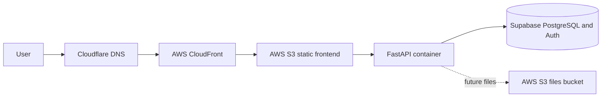

# Deployment

## Status

Cloud deployment is planned but not active. The repository includes a backend
Dockerfile, a local Compose service, Alembic migrations, and CI image-build
validation. No cloud resources, credentials, or automated deployments exist.

The concrete backend deployment plan for `api.ordynlife.com` is documented in
[backend-deployment-plan.md](backend-deployment-plan.md).

## Option A

### Frontend

The Next.js frontend will be designed for static export, uploaded to a private
S3 bucket, and served through CloudFront. Cloudflare will manage the domain and
DNS. CloudFront provides CDN delivery and HTTPS at the AWS edge.

Server-only Next.js features must not be introduced without reconsidering the
static hosting decision.

### Backend

FastAPI runs in a Docker container locally. The planned production target for
`api.ordynlife.com` is AWS App Runner, chosen as the first backend host because
it avoids running a separate Application Load Balancer and keeps operations
small for low portfolio traffic. ECS/Fargate remains a future upgrade path if
the app needs more infrastructure control.

S3 cannot execute the backend.

### CI/CD

Pull requests and pushes to `main` run frontend lint, typecheck, formatting, and
static build checks, plus backend lint, formatting, tests, and Docker image
builds. Main-branch deployment will later use GitHub Actions and AWS OIDC rather
than long-lived AWS keys.

Migrations must be run as an explicit, observable deployment step before code
that requires the new schema receives traffic.
